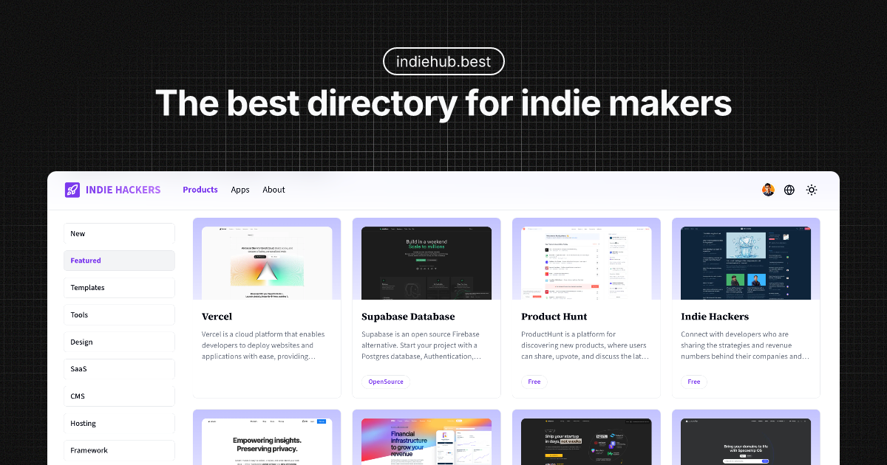

<a href="https://free-directory-boilerplate.vercel.app">
  
  <h1 align="center" style="margin-top: 20px;">Open Source Directory Boilerplate</h1>
</a>

# Websites

Website (frontend, current repository): [https://free-directory-boilerplate.vercel.app](https://free-directory-boilerplate.vercel.app)

Sanity Studio (backend): [https://free-directory-sanity.vercel.app/studio](https://free-directory-sanity.vercel.app/studio)

## Features

- Listings (Tools, Products)
- Item Detail Page
- Categories & Tags
- Authentication (GitHub and Google)
- Submission (built-in)
- Sanity Studio (built-in CMS)
- Blog (hidden by default)
- Documentation (hidden by default)
- Analytics (Umami & Google Analytics)
- SEO (Sitemap, Open Graph)
- Modern UI (Shadcn UI)
- Responsive Design
- Multi-language (English & Chinese)
- Multi-theme (Light & Dark)

## Tech Stack

- Next.js 14
- NextAuth
- Database (PostgreSQL)
- Tailwind CSS
- Shadcn UI
- Sanity
- Vercel

## How to use

1. Clone the repository
2. Run `pnpm install`
3. Configure the `.env` file
4. Run `pnpm dev`

## Mkdirs

This project is created by [Javayhu](https://x.com/javay_hu), the founder of [Mkdirs](https://mkdirs.com), which is the best directory boilerplate for anyone who wants to launch a profitable directory website in minutes.

If you are interested in indie hacking, please follow me on X: [@javay_hu](https://x.com/javay_hu)

## Notices

If you have any questions when using this project, please checkout the [docs of Mkidrs](https://docs.mkdirs.com) for more information, because they have almost the same tech stack.

## License

This project is licensed under the MIT License - see the [LICENSE.md](LICENSE.md) file for details.
